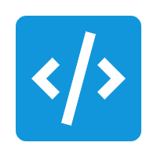

# 码悟 MaWu

<p align="center">
  
</p>

<p align="center">
  <strong>简洁 · 轻便</strong> — 末心开发的 AI 编程助手
</p>

<p align="center">
  <a href="https://github.com/Moxin1044/MaWu">GitHub</a>
</p>

---

## 项目介绍

码悟（MaWu）是一款基于 Electron + Vue 3 的极简 AI 代码编辑器，主打简洁轻便的编码体验。内置 AI 助手对话、智能代码编辑、项目翻译、安全审计等功能，支持 OpenAI 兼容 API 接口，可接入 DeepSeek、Azure、本地模型等多种服务商。适合开发者日常编码、代码审查与项目文档生成等场景。

## 环境要求

- Node.js >= 18
- npm >= 9
- Windows（当前主要支持平台）

## 安装与启动

```bash
# 克隆项目
git clone https://github.com/Moxin1044/MaWu.git
cd MaWu

# 安装依赖
npm install

# 开发模式运行
npm run dev

# 构建项目
npm run build

# 打包 Windows 安装程序
npm run package
```

## 核心功能

- **AI 对话助手** — 支持多模型切换，`@` 引用项目文件作为上下文，代码一键应用到编辑器
- **智能代码编辑** — AI 注释选中代码、AI 优化代码，自动保持缩进格式
- **项目翻译** — 一键翻译当前文件/整个项目的语言为中文或英文，精准替换文本保留代码结构
- **项目文档生成** — 右键生成 README 文档，自动分析项目结构与依赖
- **安全审计** — 对单个文件或整个目录进行安全漏洞扫描，生成专业审计报告
- **资源管理器** — 文件树支持新建/重命名/复制/剪切/粘贴，右键在系统资源管理器或终端中打开
- **内置终端** — 支持命令行操作，快捷键快速切换
- **Git 集成** — 可视化查看分支状态、暂存变更、提交代码
- **Monaco Editor** — 基于 VS Code 同款编辑器内核，支持语法高亮与多语言

## 注意事项

1. 首次使用需配置 AI 模型的 API Key 和 Base URL，支持任何 OpenAI 兼容接口
2. 打包前请确保 `resources/icon.ico` 存在，用于 Windows 安装程序图标
3. 项目翻译和安全审计功能依赖 AI 模型能力，大型项目建议分批处理

## 免责说明

本项目仅供学习与个人使用，非商业用途。项目不对 AI 生成内容的准确性负责，使用者需自行审查 AI 输出的代码与文档。
